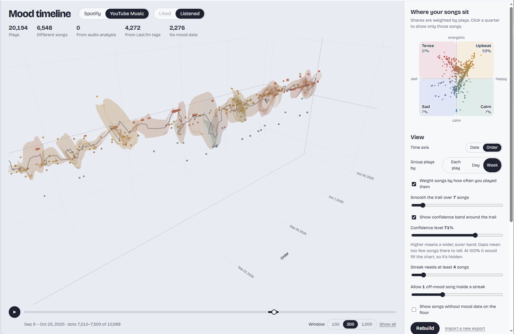

# Mood timeline

**TL;DR: A local web app that turns your YouTube Music or Spotify history into a 3D mood
timeline (time × sad–happy × calm–energetic). Install with conda, run `app.py`, open
<http://127.0.0.1:8888>, give it your data and a free Last.fm key, then press ▶ to sweep
through time.**



## Quick start

```bash
conda env create -p ./.conda-env -f environment.yml   # once
./.conda-env/bin/python app.py                         # add --demo to try synthetic data
```

Open <http://127.0.0.1:8888> (not `localhost`) and keep the terminal open while you use it.

Songs need a mood source. Paste at least one under **API keys** in the app. It checks the key,
saves it to `.env` on your computer and uses it right away (or edit `.env` yourself and restart):

- **Last.fm** (`LASTFM_API_KEY`): free and instant at <https://www.last.fm/api/account/create>.
  Moods come from listeners' tags.
- **Spotify** (`SPOTIFY_CLIENT_ID`, `SPOTIFY_CLIENT_SECRET`): moods measured from the audio,
  much more precise. Setup below.

The first build looks up every song. Last.fm allows about 4 requests a second, so 7,500 songs
take 30–45 minutes. Results are cached in `data/mood_cache.json`, so rebuilds are quick.

## Your data

**YouTube Music** (Google Takeout)

1. At <https://takeout.google.com>, click Deselect all and tick YouTube and YouTube Music.
2. Under All YouTube data included, keep only history and playlists.
3. Under Multiple formats, set history to JSON. HTML also works for English and Turkish exports.
4. Download the zip, switch the app to YouTube Music and upload it.
5. Pick your liked-songs file, or "history only" if there isn't one, and use Listened.

**Spotify**

1. At <https://developer.spotify.com/dashboard>, create a Web API app with the redirect URI
   `http://127.0.0.1:8888/callback`.
2. Paste its client ID and secret under API keys, then click Connect Spotify.
3. The app's owner needs Premium. On a 403, add your email under User Management.

Spotify also improves YouTube moods: songs are matched by title and artist, and matches
under 75% similar are skipped.

## Reading the chart

- **Axes**: time (Date, or Order to spread out bursts), valence (sad to happy) and energy
  (calm to energetic).
- **Dots**: songs, coloured by mood: upbeat, calm, sad or tense. Bigger means played more.
  Circles come from audio analysis, diamonds from Last.fm song tags, squares from artist
  tags (the roughest).
- **Trail and band**: the moving average mood, and how sure it is (Confidence level, 0–100%).
- **Liked / Listened**: your likes, or every play grouped by play, day or week (YouTube only).
- **Compass**: each mood's share. Click a quarter to highlight those songs.
- **Sweep** (bar under the chart): Window All shows everything; 100, 300 or 1,000 show a
  slice, and ▶ slides it through time. The dark part of the track is what's on screen.
  Drag or scroll to turn the chart; the sweep waits.
- **Mood streaks**: runs of songs in one mood. Click one to zoom in.

## Files

| File | Purpose |
| --- | --- |
| `app.py` | Flask server, Spotify sign-in, uploads, builds, demo data |
| `youtube.py` | Takeout import (JSON or HTML, English or Turkish), title cleanup, Spotify matching |
| `sources.py` | Spotify likes, ReccoBeats and Last.fm lookups, cache |
| `mood.py` | Last.fm tag → (valence, energy) lexicon |
| `static/app.js` | Views, sweep, streaks, trail and band, 3D chart (Plotly.js) |

## Caveats

- Valence is how the music *sounds*: a sad lyric over a bright arrangement reads happy.
- Takeout logs every play that started, including skips and autoplay.
- Liked videos that aren't clearly songs are left out, and matching can pick the wrong
  version of a song (live, remix, cover).
- Method: each dot weighs plays × mood confidence. The band is the Hotelling T² region of
  the weighted mean, using Kish's effective sample size.

## Acknowledgements

- Original idea and MVP: Emir Soydal.
- YouTube Music support and additional features: Abdullah Kavaklı.
- Coded with the help of Claude (Anthropic).

## License

Apache License 2.0. See [LICENSE](LICENSE) and [NOTICE](NOTICE).
